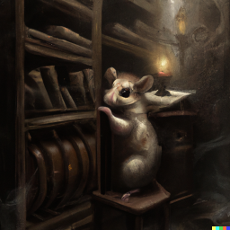

# SRA_RUNFINDER

A GUI to make it easier to search the Sequence Read Archive (SRA) https://www.ncbi.nlm.nih.gov/sra for *A. fumigatus* sequence runs

**SRA_RUNFINDER.py** is a GUI designed using TKINTER to help search for useful RNA_seq runs from SRA 
It comes with a database of ***A. fumigatus*** runs downloaded May '22 - **Combined_pmc.csv**  
Both **SRA_RUNFINDER.py** and **Combined_pmc.csv** are in the **SRA_RUNFINDER** folder 
The instructions for running it are in **How_to_use_SRA_RUNFINDER.pdf**
 
**New databases** can be built as described in **How_to_use_SRA_RUNFINDER.pdf** 
The code  for this is in the **FOR_NEW_DATABASE** folder

